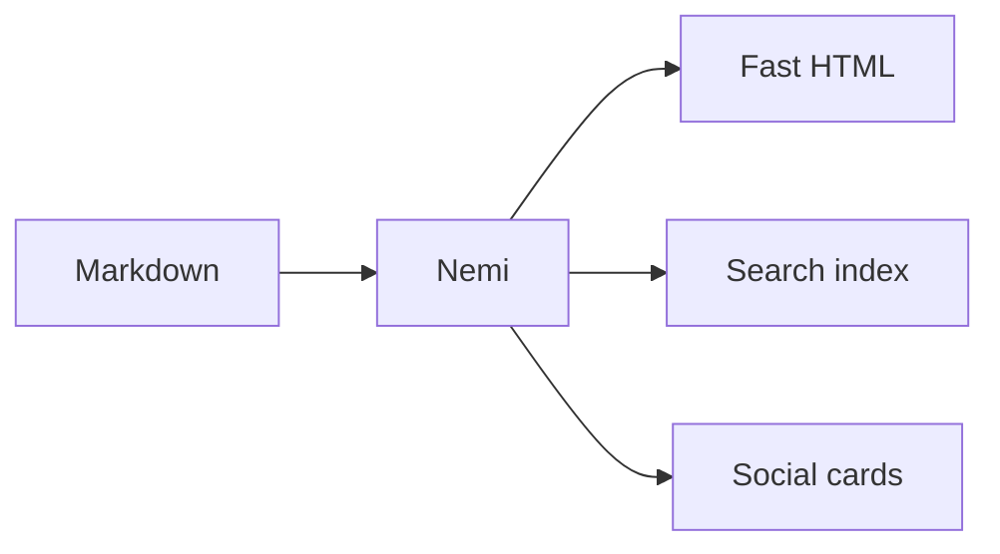

Everything here works with **zero configuration**. This page is built with Nemi,
so what you're reading is also the demo.

## Search

A client-side full-text search index is generated on every build. Press
<kbd>/</kbd> or <kbd>⌘K</kbd> to try it. No external service, no extra binary —
just a JSON index your browser filters. Disable it with `[search] disable = true`.

## Responsive images

Local images are automatically resized into a `srcset` with intrinsic
dimensions and lazy loading, so visitors download the right size and pages
don't shift as they load:

```markdown

```

becomes an `` — no manual work.

## Social cards & SEO

Every page gets OpenGraph and Twitter Card tags, schema.org JSON-LD, and an
auto-generated 1200×630 social card image — so links look great when shared.
Sitemap, RSS, canonical URLs, and `robots.txt` are written too.

## Syntax highlighting

Fenced code blocks are highlighted at build time (no client-side JS), with a
copy button and light/dark-aware colors:

```go
func main() {
    fmt.Println("Hello, Nemi")
}
```

## Math

Write LaTeX with `math: true` in your frontmatter:

$$
\chi(s) = \sum_{n=1}^{\infty} \frac{1}{n^{s}}
$$

Inline math like $e^{i\pi} + 1 = 0$ works too.

## Diagrams

Fenced ```mermaid blocks render as diagrams:



## And the basics

Tables, footnotes[^1], task lists, smart typography, tags, pagination, a sticky
table of contents, and automatic dark mode — all included.

[^1]: Like this one.
